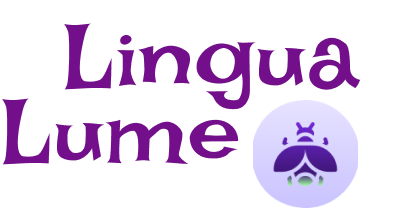

# 

 LÍNGUA LUME -TRADUTOR 

 Com Língua Lume a comunicação repassa conhecimentos entre línguas distintas, facilitando a compreensão do leitor, visto que o conhecimento de outras línguas chega a ser bastante complexo na língua materna. 

### TEMAS
- [Como funciona o Língua Lume?](#como-funciona?)
- [Descrição do projeto FruitVyce](#descrição-do-projeto)
- [Ferramentas Utilizadas](#ferramentas-utilizadasAPI)

## Como funciona o Língua Lume?

O Língua Lume é responsável por transpor o conteúdo de um texto de um idioma para outro, mantendo o significado e a intenção originais. 

## Descrição do projeto FruitVyce

 Projeto desenvolvido no Curso de Desenvolvimento de Sistemas, orientado pelo professor Vitor de Jesus pela matéria de Projetos na Instituição Senai Prof° Vicente Amato - Jandira, SP 📍. O projeto pode ser acessado em GitHub Pages: 
 
<a>https://github.com/carolneponucenaa/Lingua-Lume.git</a>

## Ferramentas Utilizadas

<strong>CSS, HTML, JS</strong> 

